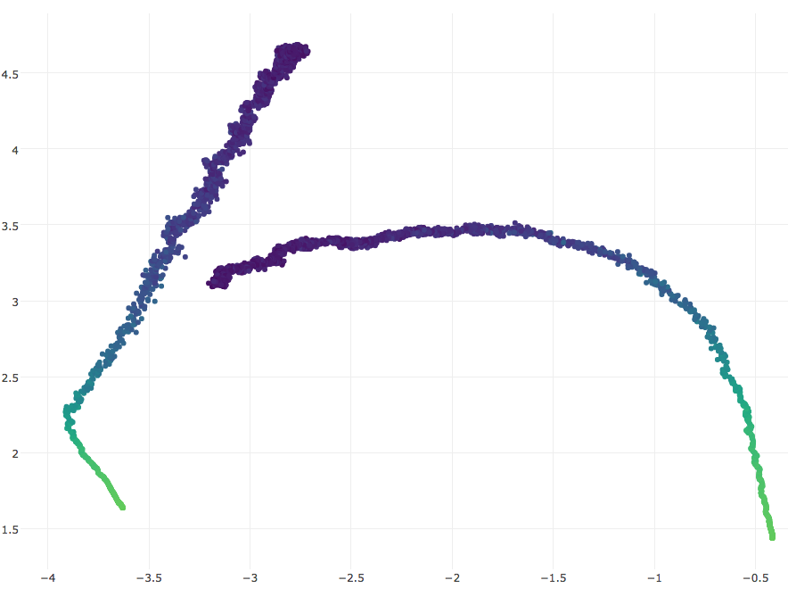
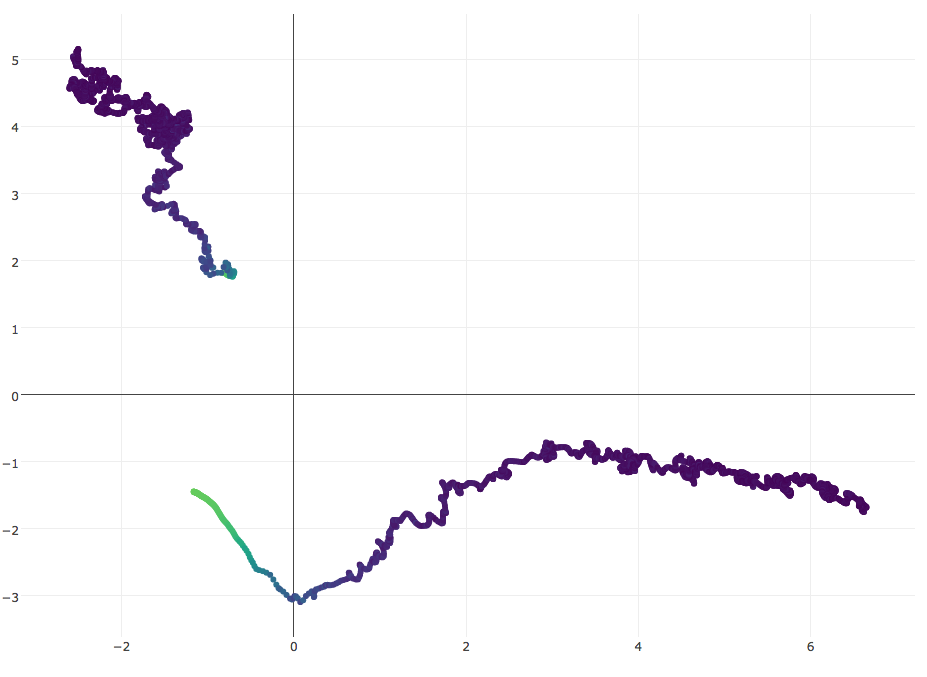

# Visualizing Optimization in Neural Nets (work in progress)

Visualizing optimization in neural nets using random matrix projections.

## Examples

### CNN MNIST optimization trajectories
SGD

SGD with momentum

## Dependencies
- `keras`
- `tensorflow` (only tested on tensorflow backend)
- `plotly`
